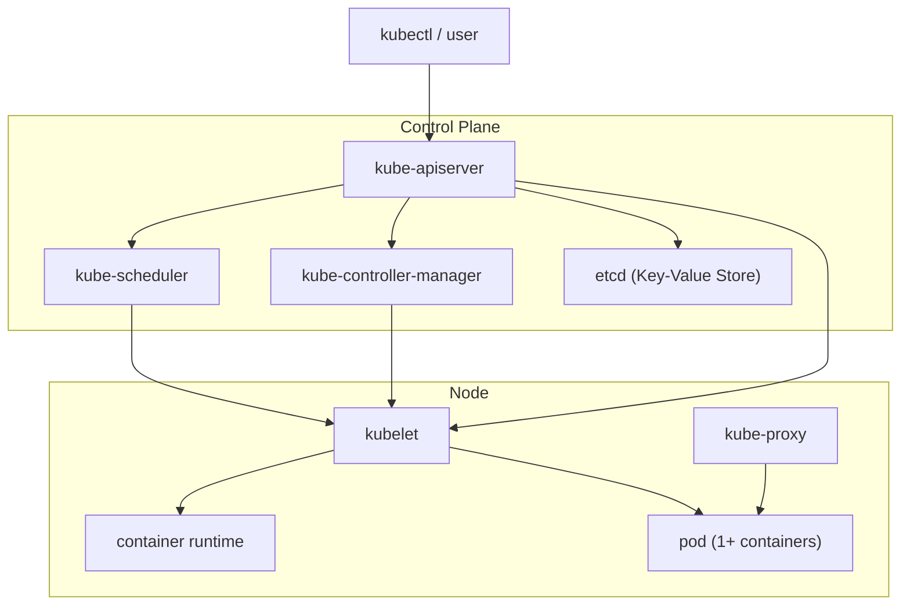

# CKAD Preparation, What is Kubernetes

## Introduction

This blog post marks the beginning of a series designed to help you prepare for the Certified Kubernetes Application Developer (CKAD) exam through hands-on exercises and practical examples. Whether you're just starting out with Kubernetes or looking to sharpen your skills, each post will walk you through one of the core competencies required for the certification. Since these are topics I need to review for my own exam, I thought—why not publish my notes? They might be useful for others who are considering taking the CKAD for the first time, or for those retaking it and needing a refresher on key concepts.

At the time of writing, the CKAD exam has the following requirements:

Application Design and Build
- Define, build and modify container images
- Choose and use the right workload resource (Deployment, DaemonSet, CronJob, etc.)
- Understand multi-container Pod design patterns (e.g. sidecar, init and others)
- Utilize persistent and ephemeral volumes

Application Deployment
- Use Kubernetes primitives to implement common deployment strategies (e.g. blue/green or canary)
- Understand Deployments and how to perform rolling updates
- Use the Helm package manager to deploy existing packages
- Kustomize

Application Observability and Maintenance
- Understand API deprecations
- Implement probes and health checks
- Use built-in CLI tools to monitor Kubernetes applications
- Utilize container logs
- Debugging in Kubernetes

Discover and use resources that extend Kubernetes (CRD, Operators)
- Understand authentication, authorization and admission control
- Understand requests, limits, quotas
- Understand ConfigMaps
- Define resource requirements
- Create & consume Secrets
- Understand ServiceAccounts
- Understand Application Security (SecurityContexts, Capabilities, etc.)

Services and Networking
- Demonstrate basic understanding of NetworkPolicies
- Provide and troubleshoot access to applications via services
- Use Ingress rules to expose applications

I know there are a lot of topics, but we'll address them one by one with practical examples.

For now, in this lesson, we'll cover some key concepts. In the next ones, we will prepare the environment needed for our playground experiments.

## What Is Kubernetes?

Kubernetes (often abbreviated as K8s) is an open-source platform for automating the deployment, scaling, and management of containerized applications. Originally developed by Google and now maintained by the Cloud Native Computing Foundation (CNCF), Kubernetes has become the de facto standard for container orchestration in modern cloud-native environments.

## Why Is Kubernetes Important?

Kubernetes solves several critical challenges in modern software development:

- Orchestration: Automatically manages the lifecycle of containers, ensuring they run where and when needed.
- Scalability: Easily scale applications up or down based on demand.
- Resilience: Automatically restarts failed containers and reschedules workloads on healthy nodes.
- Declarative Configuration: Use YAML manifests to define desired system state, making infrastructure reproducible and version-controlled.

## Where Is Kubernetes Used?

Kubernetes is widely adopted across industries and is especially popular in:

- Cloud-native applications: Designed to run in distributed, scalable environments.
- Microservices architectures: Manages multiple loosely coupled services efficiently.
- Hybrid and multi-cloud setups: Offers portability across cloud providers and on-premise infrastructure.
- DevOps workflows: Integrates seamlessly with CI/CD pipelines and infrastructure-as-code tools.

## Kubernetes architecture

Kubernetes is built around a master-worker architecture. The Control Plane manages the cluster and makes global decisions (e.g., scheduling), while the Nodes (workers) run the actual applications in containers. 

Please note that the control plane can also run on a worker node. In these cases, these nodes are usually "tainted", meaning they only run the control plane components and not regular workloads.

## 🖥️ What Is a Node in Kubernetes?

In Kubernetes, a Node is a physical or virtual machine that runs containerized applications. It’s the worker unit of the cluster—responsible for executing workloads and hosting the components that make containers run.

A cluster typically has multiple nodes, and Kubernetes distributes Pods across them based on resource availability and scheduling rules.

Every node includes:
- kubelet: The agent that communicates with the control plane and manages Pods on the node.
- container runtime: The software that actually runs containers (e.g., containerd, CRI-O).
- kube-proxy: Handles network routing and service discovery for Pods.

These components work together to ensure that containers are started, monitored, and connected properly.

## 🧩 Kubelet and the Container Runtime

Every node in a Kubernetes cluster that runs workloads—or even components of the control plane—relies on two key services: the kubelet and a container runtime, such as containerd.

The container runtime is the low-level component responsible for actually running containers on the node. containerd, for example, is part of the Open Container Initiative (OCI) stack. Originally bundled with Docker, it has since evolved into a standalone and widely adopted runtime. Under the hood, containerd uses runc to create and manage containers, but we won’t dive into that level of detail here.

The kubelet is the Kubernetes agent that runs on each node. It communicates with the control plane and ensures that containers are running according to the specifications defined in the cluster’s configuration. In short, it’s responsible for managing Pods on its node.

Before going further, let’s introduce the concept of a Pod.

A Pod is the smallest deployable unit in Kubernetes. It’s not just a single container, but rather a logical wrapper around one or more containers that are designed to run together on the same node.

Think of a Pod as a sandbox that:
- Shares a single network namespace (same IP and port space)
- Can share storage volumes
- Has a unified lifecycle (containers start, stop, and are scheduled together)

From Kubernetes’ perspective, the Pod is the only unit that actually runs. Everything else—Deployments, ReplicaSets, Jobs—is a declarative resource that defines how Pods should be created, managed, scaled, and updated.

## 📦 Static Pods

One of the kubelet’s special capabilities is managing static Pods—Pods defined directly at the node level, outside the control of the API server.

A static Pod is created and monitored by the kubelet itself. Here’s how it works:
- The kubelet reads a YAML manifest from a local directory (typically /etc/kubernetes/manifests/)
- It creates and runs the Pod autonomously, even if the control plane isn’t active
- These Pods can’t be created or deleted via kubectl, although they are visible in the cluster

The kubelet’s configuration file (usually located at /var/lib/kubelet/config.yaml) includes a property that defines the path to the static Pod manifests.

Static Pods are primarily used to bootstrap the cluster, allowing the kubelet to start critical components before the API server is available. In fact, the API server itself is often deployed as a static Pod, along with other essential services like the scheduler, etcd, and the controller manager. In some setups, these components may also be installed as standalone Linux services.

In short: Static Pods are the foundation that allows Kubernetes to start itself.

## 🔀 kube-proxy

Let’s now look at kube-proxy, the key component responsible for managing network connectivity between Pods and Services.

kube-proxy runs on every node in the cluster—typically as a DaemonSet, meaning one Pod per node. Its main job is to implement Kubernetes’ service networking logic, ensuring that traffic reaches the correct backend Pods.

Depending on the mode in use, kube-proxy modifies the kernel’s routing table to redirect traffic. It supports three modes:
- iptables (default): Creates iptables rules for each Service and its endpoints. The kernel handles routing directly, without needing a persistent user-space process.
- ipvs: Uses the Linux IP Virtual Server (IPVS) for more efficient load balancing. Requires the ip_vs kernel module and is ideal for large clusters.
- userspace: An older, deprecated mode where kube-proxy manually forwards traffic. It has been replaced by iptables and ipvs.

In iptables mode, kube-proxy programs kernel DNAT rules to distribute traffic across backend Pods in a pseudo-random (effectively round-robin) fashion. Each new TCP connection is pinned to a selected Pod, ensuring consistent routing for the duration of the connection.

## 🌐 Introducing the concept of Service

Since we’ve mentioned Services, let’s formally introduce them.

While Pods have IP addresses, they are ephemeral—meaning their IPs can change at any time. A Service is a Kubernetes API object that provides a stable network endpoint for one or more Pods acting as a backend. This abstraction allows clients (like frontends or other services) to connect without needing to know the details of Pod IPs or lifecycle.

There are several types of Services:
- ClusterIP (default): Creates an internal virtual IP accessible only within the cluster.
- NodePort: Exposes the Service on a static port (30000–32767) of each node.
- LoadBalancer: Delegates the creation of an external load balancer to the cloud or on-prem provider (e.g., MetalLB).
- ExternalName: Maps the Service to an external DNS name.
- Headless Service: Does not create a ClusterIP (clusterIP: None), allowing DNS to return the IPs of individual Pods.

Here's a quick recap:

| Service Type | Access | Stable IP | Load Balancer | Typical use case |
|---|---|:---:|:---:|---|
| ClusterIP | Internal to cluster | ✅ | ❌ | Internal service-to-service communication |
| NodePort | External (node IP + port) | ✅ | ❌ | Direct access via node (simple exposure / debugging) |
| LoadBalancer | External (public IP) | ✅ | ✅ | Production exposure via cloud or external LB |
| ExternalName | DNS mapping to external service | ❌ | ❌ | Referencing external services by DNS |
| Headless | Direct Pod endpoints (no ClusterIP) | ❌ | ❌ | StatefulSets, distributed databases, custom service discovery |

Note: LoadBalancer and ExternalName may require external components like MetalLB to function in bare-metal environments.

## 🛣️ Introducing the CNI

While kube-proxy handles where traffic should go, it doesn’t handle how Pods communicate across nodes. That’s the job of the Container Network Interface (CNI).

CNI is a standard that defines how containers connect to each other and to external networks. Kubernetes relies on CNI plugins to provide cluster-wide networking.

Popular CNI plugins like Calico, Cilium, or Flannel can:
- Assign unique IPs to each Pod across the cluster
- Create routing between nodes for cross-node Pod communication
- Enforce network policies (e.g., firewall rules, namespace isolation)

Without a CNI plugin, Pods would only be able to communicate within the same node—making Kubernetes unusable in multi-node setups.

In summary: kube-proxy decides where traffic should go, CNI ensures it can get there.

## 🌐 Introducing CoreDNS: Internal DNS for Kubernetes

Before moving on to the control plane components, let's introduce the internal DNS used by Kubernetes for name resolution.

CoreDNS is the default DNS server used by Kubernetes to provide internal name resolution for Services and Pods. It runs as a Deployment inside the cluster and is responsible for translating service names (like my-service.default.svc.cluster.local) into IP addresses.

Whenever a Pod tries to reach another Service by name, CoreDNS is what makes that possible.

What Does CoreDNS Do?
- Resolves DNS queries for Kubernetes Services and Pods
- Integrates with Kubernetes API to stay updated on resource changes
- Supports custom DNS configurations via plugins
- Enables service discovery within the cluster

CoreDNS watches the Kubernetes API and dynamically updates its DNS records as Services and Pods are created or removed. This allows applications to communicate reliably using DNS names, even as the underlying IPs change.

## 🧭 Introducing the Control Plane: Kubernetes’ Brain

In Kubernetes, the Control Plane is the brain of the cluster. It’s responsible for managing the overall state of the system—deciding what should run, where it should run, and how it should behave. While worker nodes execute workloads (i.e., run containers), the control plane makes all the decisions that keep the cluster functioning smoothly.

What Does the Control Plane Do?
The control plane continuously monitors the cluster and ensures that the desired state (as defined by your YAML manifests) matches the actual state. If something drifts—like a Pod crashing or a node going offline—the control plane takes action to restore balance.

It handles tasks such as:
- Scheduling Pods to nodes
- Managing cluster-wide configuration
- Monitoring resource health
- Enforcing policies and access control
- Scaling applications up or down

### 🗓️ kube-scheduler: Assigning Pods to Nodes

The kube-scheduler is a core component of the Kubernetes control plane responsible for assigning newly created Pods to suitable Nodes in the cluster. When a Pod is created without a designated Node, the scheduler evaluates available Nodes and selects the best fit based on several criteria.

The scheduler considers factors such as:
- Resource availability: CPU, memory, and other constraints
- Node affinity/anti-affinity rules
- Taints and tolerations
- Pod affinity/anti-affinity
- Custom scheduling policies

Once a Node is selected, the scheduler updates the Pod’s specification with the chosen Node name, allowing the kubelet on that Node to take over and start the Pod.

### 🧩 kube-controller-manager: Maintaining Desired State

The kube-controller-manager runs a set of controllers that continuously monitor the cluster and ensure its actual state matches the desired state defined in your manifests.

- Each controller handles a specific task, such as:
- ReplicationController: Ensures the correct number of Pod replicas
- NodeController: Monitors node health and availability
- JobController: Manages Job execution and completion
- EndpointController: Updates Service endpoints

These controllers operate in loops, watching the API server for changes and taking action to reconcile differences.

### 🧠 API Server: The Front Door of Kubernetes

The API Server is the central hub of communication in a Kubernetes cluster. It acts as the front door to the control plane, exposing a RESTful API that allows users, components, and tools to interact with the cluster.

Whether you're using kubectl, deploying a new application, or a controller is watching for changes—everything goes through the API Server.

What Does It Do?
- Validates requests: Ensures submitted manifests are syntactically and semantically correct.
- Serves the Kubernetes API: Provides endpoints for reading and writing cluster state.
- Authentication & Authorization: Verifies who is making the request and whether they’re allowed to do so.
- Acts as a gateway: Routes requests to other control plane components like the scheduler or controller manager.

In essence, the API Server is the brain’s interface—it doesn’t make decisions, but it receives all the signals and passes them to the right parts of the system.

### 🗄️ etcd: The Cluster’s Memory

etcd is a distributed key-value store that serves as the source of truth for all cluster data. It stores the entire state of the Kubernetes cluster—everything from Pod definitions to ConfigMaps, Secrets, and node status.

Think of etcd as Kubernetes’ memory: if it’s not in etcd, it doesn’t exist in the cluster.

What Does It Store?
- Cluster configuration and metadata
- Resource definitions (Pods, Services, Deployments, etc.)
- State information (node health, leases, etc.)
- Security data (RBAC rules, Secrets)

etcd is designed to be highly available and consistent, using the Raft consensus algorithm to replicate data across multiple nodes.

## 🏁 Wrapping Up: What We’ve Covered

In this first post, we explored what Kubernetes is, the key requirements for passing the CKAD exam, and the architecture and components that make up a Kubernetes cluster. These may seem like dry fundamentals—but they’re absolutely essential if we want to build a solid understanding of how Kubernetes works under the hood.

Grasping these core concepts sets the stage for everything that follows.

In the upcoming posts, we’ll dive into the actual CKAD competencies through hands-on exercises and practical examples. From building container images to deploying applications, configuring probes, and working with Services and Secrets—we’ll tackle each topic with real-world scenarios and YAML you can run yourself.

Stay tuned, and let’s get our hands dirty with Kubernetes.