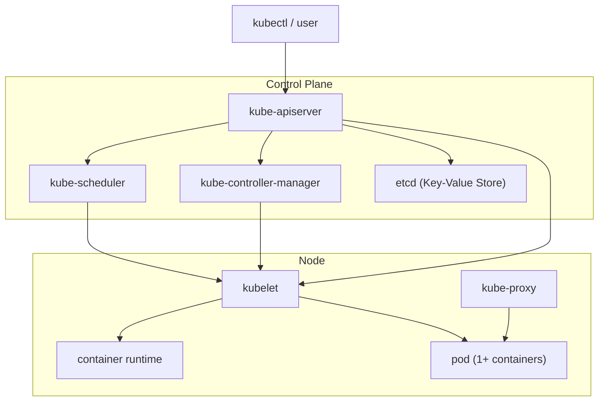

# Preparazione CKAD: Cos'è Kubernetes

## Introduzione

Questo post inaugura una serie pensata per aiutarti a preparare l'esame Certified Kubernetes Application Developer (CKAD) tramite esercizi pratici ed esempi reali. Che tu sia agli inizi con Kubernetes o voglia affinare le tue competenze, ogni articolo tratterà una delle competenze chiave richieste per la certificazione.

Poiché sono argomenti che devo rivedere anch'io per il mio esame, ho pensato — perché non pubblicare le mie note? Potrebbero essere utili ad altri che si avvicinano al CKAD per la prima volta o a chi lo ripassa come promemoria sui concetti chiave.

Al momento della stesura, l'esame CKAD richiede quanto segue:

Progettazione e costruzione dell'applicazione
- Definire, costruire e modificare immagini container
- Scegliere e utilizzare la risorsa workload corretta (Deployment, DaemonSet, CronJob, ecc.)
- Comprendere i pattern di progettazione multi-container nei Pod (es. sidecar, init e altri)
- Utilizzare volumi persistenti ed effimeri

Distribuzione dell'applicazione
- Usare i primitivi di Kubernetes per implementare strategie di deployment comuni (es. blue/green o canary)
- Comprendere i Deployment e come eseguire rolling update
- Usare il package manager Helm per distribuire pacchetti esistenti
- Kustomize

Osservabilità e manutenzione delle applicazioni
- Comprendere le deprecazioni API
- Implementare probe e controlli di salute
- Usare gli strumenti CLI integrati per monitorare le applicazioni Kubernetes
- Utilizzare i log dei container
- Eseguire il debug in Kubernetes

Scoprire e usare risorse che estendono Kubernetes (CRD, Operator)
- Comprendere autenticazione, autorizzazione e admission control
- Comprendere requests, limits, quotas
- Comprendere ConfigMap
- Definire requisiti di risorse
- Creare e consumare Secrets
- Comprendere ServiceAccount
- Comprendere la sicurezza delle applicazioni (SecurityContexts, Capabilities, ecc.)

Servizi e networking
- Dimostrare una conoscenza di base delle NetworkPolicy
- Fornire e risolvere l'accesso alle applicazioni tramite i Service
- Usare le regole Ingress per esporre le applicazioni

So che sono molti argomenti, ma li affronteremo uno per uno con esempi pratici.

Per ora, in questa lezione, copriremo alcuni concetti chiave. Nei prossimi articoli prepareremo l'ambiente necessario per i nostri esperimenti in sandbox.

## Cos'è Kubernetes?

Kubernetes (spesso abbreviato K8s) è una piattaforma open source per automatizzare il deployment, lo scaling e la gestione di applicazioni containerizzate. Sviluppato originariamente da Google e ora mantenuto dalla Cloud Native Computing Foundation (CNCF), Kubernetes è diventato lo standard de facto per l'orchestrazione dei container negli ambienti cloud-native moderni.

## Perché Kubernetes è importante?

Kubernetes risolve diverse sfide critiche nello sviluppo software moderno:

- Orchestrazione: gestisce automaticamente il ciclo di vita dei container, assicurandosi che girino dove e quando necessario.
- Scalabilità: permette di scalare facilmente le applicazioni su o giù in base alla domanda.
- Resilienza: riavvia automaticamente i container falliti e riprogramma i workload su nodi sani.
- Configurazione dichiarativa: usare manifest YAML per definire lo stato desiderato del sistema, rendendo l'infrastruttura riproducibile e versionabile.

## Dove si usa Kubernetes?

Kubernetes è ampiamente adottato in diversi settori ed è particolarmente popolare in:

- Applicazioni cloud-native: progettate per girare in ambienti distribuiti e scalabili.
- Architetture a microservizi: gestisce più servizi disaccoppiati in modo efficiente.
- Setup ibridi e multi-cloud: offre portabilità tra provider cloud e infrastrutture on-premise.
- Workflow DevOps: si integra con CI/CD e strumenti di infrastructure-as-code.

## Architettura di Kubernetes

Kubernetes è costruito attorno a un'architettura master-worker. Il Control Plane gestisce il cluster e prende decisioni globali (es. scheduling), mentre i Node (worker) eseguono le applicazioni nei container.

Nota che il control plane può anche girare su un nodo worker. In questi casi, tali nodi sono di solito "tainted", cioè eseguono solo i componenti del control plane e non i normali workload.

## 🖥️ Cos'è un Node in Kubernetes?

In Kubernetes, un Node è una macchina fisica o virtuale che esegue applicazioni containerizzate. È l'unità di lavoro del cluster—responsabile dell'esecuzione dei workload e dell'hosting dei componenti che fanno girare i container.

Un cluster tipicamente ha più nodi, e Kubernetes distribuisce i Pod tra di essi in base alla disponibilità delle risorse e alle regole di scheduling.

Ogni nodo include:
- kubelet: l'agente che comunica con il control plane e gestisce i Pod sul nodo.
- container runtime: il software che esegue effettivamente i container (es. containerd, CRI-O).
- kube-proxy: gestisce il routing di rete e il service discovery per i Pod.

Questi componenti lavorano insieme per assicurare che i container vengano avviati, monitorati e connessi correttamente.

## 🧩 Kubelet e il Container Runtime

Ogni nodo in un cluster Kubernetes che esegue workload — o anche componenti del control plane — si basa su due servizi chiave: il kubelet e un container runtime, come containerd.

Il container runtime è il componente a basso livello responsabile dell'esecuzione dei container sul nodo. containerd, ad esempio, fa parte dello stack Open Container Initiative (OCI). Originariamente incluso con Docker, è poi evoluto in un runtime standalone e ampiamente adottato. Sotto il cofano, containerd usa runc per creare e gestire i container, ma non entreremo in quel livello di dettaglio qui.

Il kubelet è l'agente Kubernetes che gira su ogni nodo. Comunica con il control plane e garantisce che i container siano eseguiti secondo le specifiche definite nella configurazione del cluster. In breve, è responsabile della gestione dei Pod sul proprio nodo.

## 📦 Pods

Prima di procedere, introduciamo il concetto di Pod.

Un Pod è la più piccola unità distribuibile in Kubernetes. Non è solo un singolo container, ma un involucro logico attorno a uno o più container progettati per girare insieme sullo stesso nodo.

Pensa a un Pod come a un sandbox che:
- Condivide un unico namespace di rete (stesso IP e spazio porte)
- Può condividere volumi di storage
- Ha un ciclo di vita unificato (i container partono, si fermano e vengono schedulati insieme)

Dal punto di vista di Kubernetes, il Pod è l'unica unità che viene realmente eseguita. Tutto il resto — Deployment, ReplicaSet, Job — è una risorsa dichiarativa che definisce come i Pod devono essere creati, gestiti, scalati e aggiornati.

## 📦 Pod statici

Una delle capacità speciali del kubelet è gestire i Pod statici — Pod definiti direttamente a livello di nodo, al di fuori del controllo dell'API server.

Un Pod statico viene creato e monitorato dallo stesso kubelet. Ecco come funziona:
- Il kubelet legge un manifesto YAML da una directory locale (tipicamente /etc/kubernetes/manifests/)
- Crea ed esegue il Pod in modo autonomo, anche se il control plane non è attivo
- Questi Pod non possono essere creati o eliminati tramite kubectl, anche se sono visibili nel cluster

Il file di configurazione del kubelet (solitamente /var/lib/kubelet/config.yaml) include una proprietà che definisce il percorso dei manifest dei Pod statici.

I Pod statici sono principalmente usati per bootstrap del cluster, permettendo al kubelet di avviare componenti critici prima che l'API server sia disponibile. Infatti, l'API server stesso è spesso distribuito come Pod statico, insieme ad altri servizi essenziali come lo scheduler, etcd e il controller manager. In alcune configurazioni, questi componenti possono anche essere installati come servizi Linux standalone.

In breve: i Pod statici sono la base che permette a Kubernetes di avviarsi da solo.

## 🔀 kube-proxy

Passiamo ora a kube-proxy, il componente chiave responsabile della connettività di rete tra Pod e Service.

kube-proxy gira su ogni nodo del cluster — normalmente come DaemonSet, quindi un Pod per nodo. Il suo compito principale è implementare la logica di networking dei Service di Kubernetes, assicurando che il traffico raggiunga i Pod backend corretti.

A seconda della modalità in uso, kube-proxy modifica la tabella di routing del kernel per reindirizzare il traffico. Supporta tre modalità:
- iptables (predefinita): crea regole iptables per ogni Service e i suoi endpoint. Il kernel gestisce il routing direttamente, senza bisogno di un processo user-space persistente.
- ipvs: usa il Linux IP Virtual Server (IPVS) per un load balancing più efficiente. Richiede il modulo di kernel ip_vs ed è ideale per cluster di grandi dimensioni.
- userspace: una modalità più vecchia e deprecata in cui kube-proxy inoltra manualmente il traffico. È stata sostituita da iptables e ipvs.

In modalità iptables, kube-proxy programma regole DNAT del kernel per distribuire il traffico tra i Pod backend in modo pseudo-casuale (effettivamente round-robin). Ogni nuova connessione TCP viene "pinnata" a un Pod selezionato, garantendo instradamento consistente per la durata della connessione.

## 🌐 Introduzione al concetto di Service

Dal momento che abbiamo menzionato i Service, introduciamoli formalmente.

Sebbene i Pod abbiano indirizzi IP, sono effimeri — i loro IP possono cambiare in qualsiasi momento. Un Service è un oggetto API di Kubernetes che fornisce un endpoint di rete stabile per uno o più Pod che agiscono da backend. Questa astrazione permette ai client (come frontend o altri servizi) di connettersi senza dover conoscere i dettagli degli IP o del ciclo di vita dei Pod.

Esistono diversi tipi di Service:
- ClusterIP (predefinito): crea un IP virtuale interno accessibile solo all'interno del cluster.
- NodePort: espone il Service su una porta statica (30000–32767) di ogni nodo.
- LoadBalancer: delega la creazione di un bilanciatore di carico esterno al provider cloud o on-prem (es. MetalLB).
- ExternalName: mappa il Service a un nome DNS esterno.
- Headless Service: non crea un ClusterIP (clusterIP: None), permettendo al DNS di restituire gli IP dei singoli Pod.

Ecco un rapido riepilogo:

| Tipo di Service | Accesso | IP stabile | Bilanciatore di carico | Caso d'uso tipico |
|---|---|:---:|:---:|---|
| ClusterIP | Interno al cluster | ✅ | ❌ | Comunicazione interna servizio-servizio |
| NodePort | Esterno (IP nodo + porta) | ✅ | ❌ | Accesso diretto tramite il nodo (esposizione semplice / debugging) |
| LoadBalancer | Esterno (IP pubblico) | ✅ | ✅ | Esposizione in produzione tramite cloud o LB esterno |
| ExternalName | Mappatura DNS verso servizio esterno | ❌ | ❌ | Riferire servizi esterni tramite DNS |
| Headless | Endpoint diretti dei Pod (nessun ClusterIP) | ❌ | ❌ | StatefulSet, database distribuiti, discovery personalizzata |

Nota: LoadBalancer ed ExternalName possono richiedere componenti esterni come MetalLB per funzionare in ambienti bare-metal.

## 🛣️ Introduzione al CNI

Mentre kube-proxy si occupa di dove deve andare il traffico, non gestisce come i Pod comunicano attraverso i nodi. Questo è compito dell'Container Network Interface (CNI).

CNI è uno standard che definisce come i container si connettono tra di loro e alle reti esterne. Kubernetes si affida a plugin CNI per fornire il networking a livello di cluster.

Plugin CNI popolari come Calico, Cilium o Flannel possono:
- Assegnare IP unici a ciascun Pod attraverso il cluster
- Creare routing tra nodi per la comunicazione cross-node dei Pod
- Applicare NetworkPolicy (es. regole firewall, isolamento tra namespace)

Senza un plugin CNI, i Pod potrebbero comunicare solo all'interno dello stesso nodo — rendendo Kubernetes inutilizzabile in configurazioni multi-nodo.

In sintesi: kube-proxy decide dove deve andare il traffico, mentre il CNI assicura che possa effettivamente arrivarci.

## 🌐 Introduzione a CoreDNS: DNS interno per Kubernetes

Prima di passare agli altri componenti del control plane, introduciamo il DNS interno usato da Kubernetes per la risoluzione dei nomi.

CoreDNS è il server DNS predefinito usato da Kubernetes per fornire la risoluzione dei nomi interna per Service e Pod. Gira come Deployment all'interno del cluster ed è responsabile della traduzione dei nomi dei service (es. my-service.default.svc.cluster.local) in indirizzi IP.

Quando un Pod tenta di raggiungere un altro Service per nome, è CoreDNS che rende ciò possibile.

Cosa fa CoreDNS?
- Risolve le query DNS per Service e Pod di Kubernetes
- Si integra con l'API di Kubernetes per rimanere aggiornato sui cambiamenti delle risorse
- Supporta configurazioni DNS personalizzate tramite plugin
- Abilita il service discovery all'interno del cluster

CoreDNS osserva l'API server e aggiorna dinamicamente i suoi record DNS quando Service e Pod vengono creati o rimossi. Questo permette alle applicazioni di comunicare in modo affidabile usando nomi DNS, anche quando gli IP sottostanti cambiano.

## 🧭 Introduzione al Control Plane: il cervello di Kubernetes

In Kubernetes, il Control Plane è il cervello del cluster. È responsabile della gestione dello stato complessivo del sistema — decide cosa deve girare, dove deve girare e come deve comportarsi. Mentre i nodi worker eseguono i workload (cioè eseguono i container), il control plane prende tutte le decisioni che mantengono il cluster funzionante.

Cosa fa il Control Plane?
Il control plane monitora continuamente il cluster e garantisce che lo stato desiderato (definito dai tuoi manifest YAML) corrisponda allo stato reale. Se qualcosa diverge — per esempio un Pod che si arresta o un nodo che va offline — il control plane interviene per ripristinare l'equilibrio.

Gestisce compiti quali:
- Schedulazione dei Pod sui nodi
- Gestione della configurazione a livello di cluster
- Monitoraggio della salute delle risorse
- Applicazione di policy e controllo degli accessi
- Scalare le applicazioni su o giù

### 🗓️ kube-scheduler: assegnare i Pod ai nodi

Il kube-scheduler è un componente core del control plane responsabile di assegnare i Pod appena creati ai nodi idonei nel cluster. Quando un Pod viene creato senza un nodo designato, lo scheduler valuta i nodi disponibili e seleziona il migliore in base a diversi criteri.

Lo scheduler considera fattori come:
- Disponibilità delle risorse: CPU, memoria e altri vincoli
- Regole di affinity/anti-affinity sui nodi
- Taints e tolerations
- Affinity/anti-affinity tra Pod
- Policy di scheduling personalizzate

Una volta selezionato un nodo, lo scheduler aggiorna la specifica del Pod con il nome del nodo scelto, permettendo al kubelet su quel nodo di subentrare e avviare il Pod.

### 🧩 kube-controller-manager: mantenere lo stato desiderato

Il kube-controller-manager esegue un insieme di controller che monitorano continuamente il cluster e assicurano che lo stato reale corrisponda a quello desiderato definito nei manifest.

- Ogni controller gestisce un compito specifico, per esempio:
- ReplicationController: garantisce il numero corretto di repliche dei Pod
- NodeController: monitora la salute e la disponibilità dei nodi
- JobController: gestisce l'esecuzione e il completamento dei Job
- EndpointController: aggiorna gli endpoint dei Service

Questi controller operano in loop, osservando l'API server per i cambiamenti e prendendo azioni per riconciliare le differenze.

### 🧠 API Server: la porta d'ingresso di Kubernetes

L'API Server è il fulcro della comunicazione in un cluster Kubernetes. Agisce come porta d'ingresso al control plane, esponendo un'API RESTful che permette a utenti, componenti e strumenti di interagire con il cluster.

Sia che tu stia usando kubectl, distribuendo una nuova applicazione o che un controller stia osservando cambiamenti — tutto passa tramite l'API Server.

Cosa fa?
- Valida le richieste: assicura che i manifest inviati siano sintatticamente e semanticamente corretti.
- Espone l'API di Kubernetes: fornisce endpoint per leggere e scrivere lo stato del cluster.
- Autenticazione e autorizzazione: verifica chi effettua la richiesta e se è autorizzato.
- Agisce da gateway: instrada le richieste verso altri componenti del control plane come lo scheduler o il controller manager.

In sostanza, l'API Server è l'interfaccia del cervello — non prende decisioni finali, ma riceve tutti i segnali e li inoltra alle parti corrette del sistema.

### 🗄️ etcd: la memoria del cluster

etcd è un key-value store distribuito che serve come fonte di verità per tutti i dati del cluster. Memorizza l'intero stato del cluster Kubernetes — tutto, dalle definizioni dei Pod a ConfigMap, Secret e stato dei nodi.

Pensa a etcd come alla memoria di Kubernetes: se non è in etcd, non esiste nel cluster.

Cosa memorizza?
- Configurazione e metadata del cluster
- Definizioni delle risorse (Pod, Service, Deployment, ecc.)
- Informazioni di stato (salute dei nodi, lease, ecc.)
- Dati di sicurezza (regole RBAC, Secret)

etcd è progettato per essere altamente disponibile e consistente, usando l'algoritmo di consenso Raft per replicare i dati su più nodi.
## 🔁 Controller e cicli di controllo: Gestire i workload in Kubernetes

Questo è l'ultimo argomento che dobbiamo affrontare. Promesso!

Una delle idee più potenti dietro Kubernetes è il concetto di configurazione dichiarativa. Non si dice a Kubernetes come fare qualcosa, ma si dice cosa si vuole, e lui si occupa del resto. Questo è reso possibile dai controller, che monitorano continuamente il cluster e lavorano per assicurare che lo stato reale corrisponda a quello desiderato.

Questo processo si chiama ciclo di controllo.

🔍 Cos'è un controller?

Un controller è un processo in background che osserva l'API di Kubernetes per eventuali cambiamenti e prende azioni per riconciliare le differenze. Per esempio, se dichiari di voler avere tre repliche di un Pod ma ne sono in esecuzione solo due, il controller ne creerà una terza.

I controller sono responsabili della creazione, aggiornamento e cancellazione dei Pod sulla base di risorse di livello superiore.

Kubernetes fornisce diversi controller integrati per gestire tipi diversi di workload:

- *Deployment*: il controller più comune per applicazioni stateless.
- *StatefulSet*: pensato per applicazioni stateful che richiedono identità stabili e storage persistente.
- *DaemonSet*: garantisce che una copia di un Pod venga eseguita su ogni nodo del cluster.

Comunemente usati per agenti a livello di nodo come collector di log, strumenti di monitoraggio o componenti di rete.

## Come vengono eseguiti i componenti di Kubernetes nel cluster

Di seguito i componenti di Kubernetes e come vengono distribuiti.

| Component | Tipo / Ruolo | Come viene eseguito | Namespace / Posizione |
|---|---|---|---|
| `kubelet` | Agente del nodo | servizio systemd (daemon Linux) | gira su ogni nodo |
| Container runtime (`containerd`, `CRI-O`) | Motore per i container | servizio systemd / daemon gestito dal SO | gira su ogni nodo |
| `kube-proxy` | Proxy di servizio / instradamento di rete | DaemonSet (un Pod per nodo) | `kube-system` |
| `etcd` | Store dello stato del cluster | Pod statico o servizio systemd (o cluster etcd esterno) | nodo(i) del control plane o esterno |
| `kube-apiserver` | Front-end del control plane | Pod statico | control-plane (`kube-system`) |
| `kube-scheduler` | Scheduling dei Pod | Pod statico | control-plane (`kube-system`) |
| `kube-controller-manager` | Riconciliazione dello stato | Pod statico | control-plane (`kube-system`) |
| `CoreDNS` | DNS interno / service discovery | Deployment | `kube-system` |

## 🏁 Riepilogo: ciò che abbiamo coperto

In questo primo post abbiamo esplorato cos'è Kubernetes, i requisiti chiave per superare l'esame CKAD e l'architettura e i componenti che costituiscono un cluster Kubernetes. Questi concetti fondamentali possono sembrare aridi — ma sono assolutamente essenziali per capire come funziona Kubernetes sotto il cofano.

Comprendere questi concetti di base crea le fondamenta per tutto ciò che seguirà.

Nei prossimi articoli entreremo nel vivo delle competenze CKAD con esercizi pratici ed esempi concreti. Dalla costruzione di immagini container al deployment di applicazioni, alla configurazione delle probe e al lavoro con Service e Secret — affronteremo ogni argomento con scenari reali e YAML eseguibili.

Restate sintonizzati, dalle prossime pubblicazioni indizeremo a sporcarci le mani sperimentando con Kubernetes.